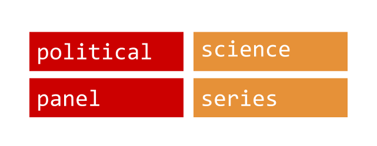

Guidelines for psData and Associated Data Gathering Packages
===

**psData** is an approach to gathering, cleaning, and merging *P*olitical *S*cience, *P*anel-*S*eries data. The approach will be implemented with the [psData](https://github.com/rOpenGov/psData) [R](http://www.r-project.org/) package and associated packages. 

## Authors

From the [initial discussion](https://github.com/rOpenGov/psData/issues/5):

* @christophergandrud
* @antagomir
* @briatte
* @jlehtoma
* @leeper
* @muuankarski
* @ouzor
* @zmjones

## Metadata 

A `psData` object is a data frame with an attribute that describes which columns are panel attributes, and how they are formatted. The package then offers functions to easily manipulate the data within these settings. Researchers who work with panel data or time series from different sources in political science and related disciplines like economics should find this package helpful for gathering and merge multiple variables together.

> __Note__: the best way to implement this is probably using an [S4 class](http://cran.r-project.org/doc/Rnews/Rnews_2003-1.pdf), which allows to have a panel superclass and other classes to handle, e.g., triadic data. Similar approaches are found in the `reshape` and `data.table` packages (IIRC). Writing up the spec will provide a nice paper appendix.

`psData` objects carry the following metadata:

- `panel` (the name of the primary panel variable)

- `format` (format of the panel ID)

- `time` (the name of the primary time marker)

- `date` (time format)

For a country-year data set, the `psData` object might have an attribute that reads like

	panel = "cid",
	format = "iso3c",
	time = "year",
	format = "%Y"

The convenience of the package comes from the data handling that can be performed for the user from these attributes:

- The `format` attribute automatically understands country codes from the [countrycode](https://github.com/vincentarelbundock/countrycode) package (e.g. ISO-2, ISO-3, COW), as well as `region` with NUTS-2 and NUTS-3 codes. Production note: it would be a good idea to support Eurostat, OECD and U.S. states.
- The `time` and `date` attributes follow the conventions of the [lubridate](https://github.com/hadley/lubridate) package. Time variables called "date", "ymd", "year", "month" or "weekday" are automatically recognized and converted to `Date` format.

If `psData` is to be flexible and portable, it would be a good idea to store the metadata in a list, to allow for several panel/time markers:

```{S}
attr(data, "psdata") = list(
	# descriptive
	name = "Example country-year dataset",
	# similar to R packages
	meta = c(aut = "John Doe <john.doe@anon.edu>", ctb = "Jane Doe <john.doe@anon.edu>", uni = "Anonymous University <http://anon.edu/>"),
	# versioning
	date = "2014-03-02", 
	version = "1.0.0",
	url = "http://foo.bar/",
	# data design
	panel = c("cid", "cname", "ccodecow"),
	format = c(cid = "iso3c", cname = "name", ccodecow = "cow"),
	time = c("year"),
	date = c("%Y")
	)
```

> __Note__: this needs to be further inspired by [DataPackage](http://dataprotocols.org/data-packages/#required-fields), and exportable to it, with the help of `rjson`, `RJSONIO` or `rjsonlite`.

In this example, `cid` and `cname` code for the same (country) variable, but they could have specific roles set by an additional `level` attribute:

```{S}
list(
	...
	# dyadic data design
	panel = c("aggressor", "target"),
	level = c(aggressor = "dyad1", target = "dyad2"),
	format = c(aggressor = "polity", target = "polity"),
	time = c("year"),
	date = c("%Y")
	)
list(
	...
	# multilevel data design
	panel = c("country", "region"),
	level = c(country = "level2", region = "level1"),
	format = c(country = "eurostat", region = "nuts2"),
	time = c("year"),
	date = c("%Y")
	)
```

The `level` attribute, however, calls for a completely different class of functions than just the basic panel settings offered by default.

## Main methods

1. `get_data`: calls functions from associated data *getter* and *variable builder* packages packages to download and build a single data frame. 

  - Arguments/capabilities: `source` the data getter/builder package to call. `vars`: labels of specific variables to gather. `...` arguments to pass to the getter/builder function. `sha1` an sha1 hash to uniquely identify data sets. This could include specific URLs, or information idiosyncratic to a particular data set. 
  
  - Need to standardise how the data should look when it is returned from the getters/builders (missing values, variable names). Stata data sets should be imported with variable labels and factorized variables.

> __Note__: a safe way to handle different downloads in different encodings on different systems has been, in my experience, using the `downloader` package with option `mode = "wb"`. It solves trouble with Windows using `wget` and others using `curl`, or other stuff like that.

2. `ps_set` (or `panel_set`): cleans the panel-series data gathered by `get_data` and standardises it into a `psData` object. 

  - Arguments/capabilities: needs arguments to set the panel and series formats. 
  
  - Needs arguments to specify how to deal with 'tricky panels', e.g. East/West Germany.

  - Needs to detect non-unique panel items.

`ps_set` assigns the `psdata` class that overrides standard methods for

  * `print`, `head` and `tail` (shows a panel version of the dataset; see how `dplyr` does that)
  * `names` (shows names and variable labels if available, settable with `ps_label`)
  * `summarize` (see `xtdes` and `xtsum` in Stata)
  * `sample` (returns a panel-adjusted sample of the dataset)
  (The following may possibly be best implemented in a separate package)
  * `plot` (returns a `gpplot2` or `lattice` time series plot? with facets?)
  * `lag` and `lead` (overriden by `ps_shift`?)
  * `subset` and `merge` (overriden by `ps_subset` and `ps_merge`)

> __Note__: the workhorse behind most operations that require aggregation is going to be either `plyr` or `dplyr`. Using the latter is much, _much_ quicker in my experience. Indeed, at this stage of `dplyr`'s development it is good to use it to the exclusion of `plyr`.

3. `panel_merge`: merges `psdata` objects into a single object. 

  - Arguments/capabilities: break if panel-series do not match. Arguments allowing the user to specify if all observations or just from one object are to be kept.
  
  - Needs to allow user to merge more than one object.

`ps_merge` supports any number of data sets and creates an attribute that specifies the source of every variable:
  
```{S}
list(
	...
	panel = c("country"),
	format = c(country = "iso3c"),
	time = c("year"),
	date = c("%Y"),
	# merged QOG/World Bank/OECD
	vars = c(country = "", var1 = "qog", var2 = "qog", var3 = "wdi", var4 = "oecd", ...)
	)
```

It should also be possible to label variables with `psData`, which makes sense for Stata users and anyone who needs to produce regression tables. The `read.dta` function can import labels, and other packages like `memisc` have their own methods. Using the method outlined above, variable labels can be stored as a simple vector set with `ps_label`:

```{S}
list(
	# variable sources
	vars = c(country = "", var1 = "qog", var2 = "qog", var3 = "wdi", var4 = "oecd", ...)
	# variable labels
	labs = c(country = "Country name", var1 = "var1", var2 = "GDP per capita", var3 = "Pop.", var4 = "etc.", ...)
	)
```

The labels are explorable with `print`, `names` and `ps_find`, which searches for keywords through variable names and labels.

## Associated: core dependencies (Depends)

* for data methods: `downloader` (see not above) and `stringr` (inevitably comes in handy at some point)
* for panel methods: `plyr` or `dplyr`, and `reshape` or `reshape2` (for `melt`; `reshape` also has the very handy `sort_df`)
* for plot methods (?): `ggplot2` or `lattice`

> __Note__: the package vignettes could show how to use the package for mixed effects or survival analysis. It should be pretty easy to code a Reinhart and Rogoff vignette. It would be great to have one on comparative election results, for instance (Cas Mudde-style), or on welfare regimes, or on varities of capitalism.

## Associated: data gathering packages (Suggests)

* `Quandl` (many quarterly series)
* `rQog` (country-year, region, some split-state exceptions)
* `WDI` (country-year, perhaps quarterly)
* `FAOSTAT` (country-year?)
* OECD (TODO, SDMX, country-year)
* Eurostat (TODO, SDMX, country-year, region)

> __Note__: data methods for Eurostat and OECD will require the recently updated `rsdmx` package.

### Further transformations

Transformations of `psData` beyond basic merging, such as creating dyadic data, lags, leads, plotting, and so on will be handled by a further package(s). A separate guideline document should be created to established a consistent framework.

## Style guide

### Naming

- Package names: modified camelCase where the first word is lower case and following words begin with a capital letter. Words are not separated. For example: 'psData'.

- Classes: all lowercase, no separators. For example: `psdata`.

- Methods, function names, and arguments: all lowercase, with words separated by an underscore `_`. For example: 'get_data'. 

- Object names in documentation and object names internal to the functions: all lowercase, with words separated by periods. For example, 'qog.data'.
